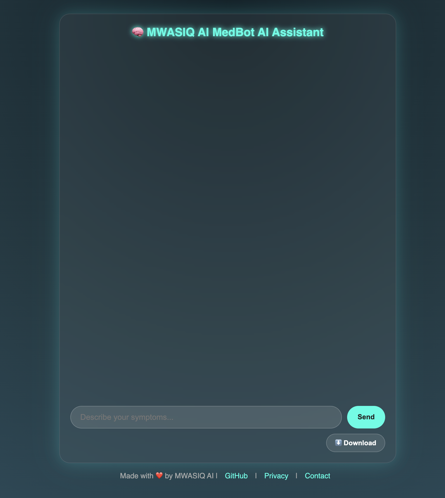
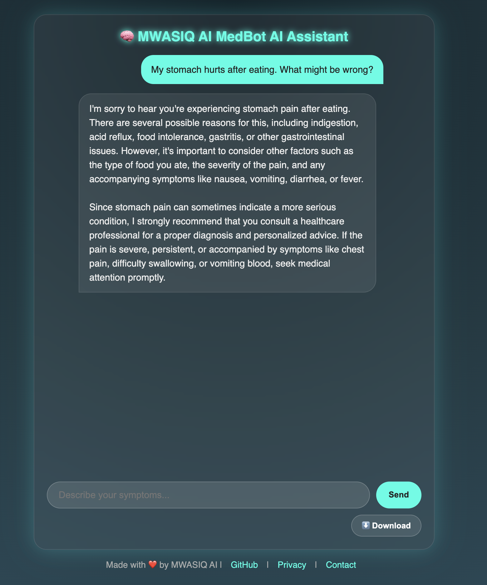

# 🧠 MWASIQ AI MedBot AI Assistant

MWASIQ AI MedBot is an intelligent, markdown-styled medical chatbot assistant powered by [EuriaiClient](https://euriai.ai). This web application helps users ask health-related questions and get informative, empathetic, and structured responses. It's built with **Flask**, integrates **EURI's GPT-4.1-nano** model, and provides clean **Markdown-like formatted replies**.

> ⚠️ This chatbot is **not a replacement for professional medical advice**. Always consult a licensed healthcare provider for real health concerns.

---

## 🚀 Features

- 🔍 AI-powered medical Q&A via EURI API
- ✨ Beautiful and responsive frontend (HTML, CSS, JS)
- 📝 Responses displayed with Markdown-style formatting
- ⬇️ Downloadable answer as `.md` file
- 📦 Simple to deploy (Flask-based backend)
- 🧠 Prompt engineering for empathetic health guidance

---

## Demo





---

## 🛠 Tech Stack

| Layer       | Technology            |
|-------------|------------------------|
| Frontend    | HTML5, CSS3, JavaScript |
| Backend     | Python (Flask)         |
| AI Model    | EuriaiClient (GPT-4.1-nano) |
| Deployment  | Flask's built-in server or gunicorn |
| Env Manager | `python-dotenv`       |

---

## 📁 Project Structure

```

MWASIQ-MedBot/
├── templates/
│   └── index.html         # Frontend UI (integrated HTML, CSS, JS)
├── static/
│   └── style.css          # Optional - used if you split styles
├── app.py                 # Flask backend server
├── .env                   # Environment variables (EURI\_API\_KEY)
├── requirements.txt       # Python dependencies
└── README.md              # Project documentation

````

---

## 🔧 Setup Instructions

### 1. Clone the Repository

```bash
git clone https://github.com/MohammadWasiq0786/MWASIQ AI-MedBot.git
cd MWASIQ-MedBot
````

### 2. Create Virtual Environment

```bash
python -m venv venv
source venv/bin/activate     # On Windows: venv\Scripts\activate
```

### 3. Install Dependencies

```bash
pip install -r requirements.txt
```

### 4. Setup Environment Variables

Create a `.env` file in the root directory:

```env
EURI_API_KEY=your_actual_euri_api_key
```

---

## ▶️ Run the App

```bash
python app.py
```

Then open your browser and go to:
👉 `http://localhost:8080/`

---

## 📤 How to Use

1. Type your medical question in the input box (e.g., *"What are the early symptoms of diabetes?"*)
2. Click **Send**
3. Receive a beautifully formatted, Markdown-style reply
4. Click **Download Response** to get a `.md` file of the AI answer

---

## 📦 requirements.txt

You can create this file using:

```bash
pip freeze > requirements.txt
```

Or use this content:

```txt
Flask
python-dotenv
euriai
```

---

## 🤖 Sample Question Ideas

Here are **intelligent, realistic, and medically relevant** questions you can ask your MedBot (medical chatbot), categorized for usefulness and variety:

---

### 🏥 **General Health Questions**

* What are the early symptoms of diabetes?
* How can I naturally lower my blood pressure?
* What does it mean if I have a persistent dry cough?
* What should I do if I have a mild fever and body aches?
* Can stress cause physical symptoms?

---

### 🤒 **Symptom-Based Questions**

* I have a sore throat and runny nose. Could it be a viral infection?
* I've had a headache for 3 days. What could be the cause?
* My stomach hurts after eating. What might be wrong?
* I feel tired all the time. Could this be anemia?
* I’m coughing with green mucus. Do I need antibiotics?

---

### 💊 **Medicine & Treatment**

* Can I take paracetamol and ibuprofen together?
* What are the side effects of using antibiotics frequently?
* How long should I take my medication for a sinus infection?
* What are the natural alternatives to sleeping pills?
* What foods shouldn’t be eaten while on blood thinners?

---

### 👶 **Child Health**

* My child has a fever. When should I go to the doctor?
* What vaccines are mandatory for children under 5?
* Is it normal for a child to have diarrhea for 2 days?

---

### 🧠 **Mental Health**

* How can I deal with anxiety without medication?
* What are the symptoms of clinical depression?
* How does lack of sleep affect mental health?

---

### 🍎 **Lifestyle, Diet & Prevention**

* What's a healthy diet plan for weight loss?
* How much exercise should I do per week?
* Can I drink coffee if I have high blood pressure?
* What are the benefits of intermittent fasting?

---

### 🧬 **Diseases and Conditions**

* What are the warning signs of a heart attack?
* How is PCOS diagnosed and treated?
* What’s the difference between type 1 and type 2 diabetes?
* What are the stages of kidney failure?

---

### 🧪 **Diagnostic Help**

* I feel dizzy and lightheaded—what tests might I need?
* What does a high WBC count mean in a blood test?
* My ESR is elevated. Should I be worried?

---


## 👨‍⚕️ Author

**Mohammad Wasiq**
*Data Scientist*
🔗 [LinkedIn](https://linkedin.com/in/mohammadwasiq0)
